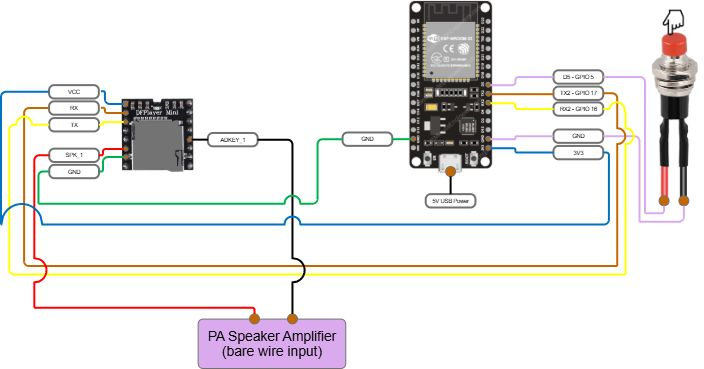

# AI Presence Announcer

An AI-triggered presence announcer that detects vehicles or people on the property and plays a chime or voice announcement through a PA speaker system.

## Overview

This project was built to solve a practical problem: standard doorbells and small smart speakers are not ideal for large outdoor spaces, yards, gates, or store environments where announcements need to be loud and easy to expand.

The AI Presence Announcer uses Ubiquiti AI camera events, Home Assistant, MQTT, Node-RED, and a custom ESP32 audio device to play chimes or spoken announcements over a conventional speaker system.

Instead of relying on a small consumer doorbell speaker, this system can trigger loud property-wide alerts through a PA-style setup.

## What it does

The system detects vehicles or people on the property and triggers a chime or voice announcement through a speaker system.

Examples include:

- A vehicle entering through a gate
- A person arriving on the property
- A manual trigger from a physical button

## Why I built it

The original goal was to create an AI-aware doorbell and arrival alert system that could play through conventional speakers and be expanded across a yard, gate area, or store.

Traditional smart doorbells are limited in volume, placement, and expandability. This project takes the detection and automation side of a smart system and combines it with louder, more flexible audio hardware.

## How it works

At a high level, the system works like this:

1. A Ubiquiti AI camera detects a vehicle or person within a predetermined zone
2. The event is brought into Home Assistant
3. Node-RED applies the event logic and any conditions
4. Node-RED publishes an MQTT message
5. A custom ESP32-based audio unit receives the MQTT trigger
6. The ESP32 tells the MP3 module to play a local sound file
7. The sound is played through the connected speaker system

The system can also be triggered locally from a physical button connected to the ESP32.

## Core components

- **Ubiquiti AI camera** for vehicle and person detection
- **Home Assistant** for automation and event handling
- **Node-RED** for logic flow and conditions
- **Mosquitto MQTT broker** for message transport
- **ESP32** as the custom announcement controller
- **DFPlayer-style MP3 module** for local audio playback
- **PA / conventional speaker system** for loud announcements

## Screenshots

### Node-RED flow logic

### Wiring diagram

## Setup and documentation

This README is meant to provide a high-level overview of the project. For setup details and implementation notes, see:

- [Parts list](docs/parts-list.md)
- [Ubiquiti AI camera setup](docs/ubiquiti-ai-camera-setup.md)
- [Home Assistant, MQTT, and Node-RED setup](docs/home-assistant-setup.md)
- [ESP32 / Arduino and DFPlayer setup](docs/arduino-setup.md)
