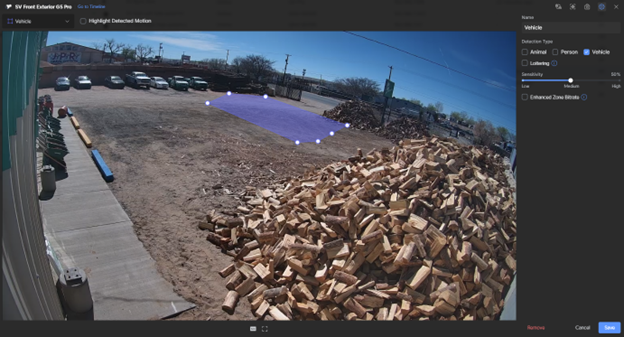

# Ubiquiti AI Camera Setup

This guide assumes a Ubiquiti camera system is already installed and working, and that Home Assistant already has access to the UniFi Protect system through the appropriate integration/API connection.

For the AI Presence Announcer project, the camera is responsible for generating the initial detection event that starts the automation flow.

## Goal

Create a detection zone on the camera so that a vehicle or person entering a specific area of the property can trigger an event in Home Assistant.

In this example, the goal was to play a chime when a **vehicle** entered a defined area near the gate.

## Configure the detection zone

Open the camera in UniFi Protect and edit the detection settings for the camera you want to use.

1. Select the camera that will monitor the target area
2. Open the smart detection zone editor
3. Draw the detection boundary over the area you want to monitor
4. Choose the detection type you want to use:
   - Vehicle
   - Person
   - or both, depending on your use case
5. Adjust sensitivity as needed
6. Save the detection zone

The example below shows a vehicle detection zone placed near the gate entrance so the announcement only triggers when a vehicle enters that area.

## Design considerations

A few things matter when setting up the zone:

- Keep the zone focused on the actual area that should trigger the announcement
- Avoid large areas that may create false positives
- Avoid overlapping roads, sidewalks, or unrelated traffic if possible
- Tune the zone and sensitivity based on real-world testing

The cleaner the zone design is, the more reliable the downstream Home Assistant and announcement automation will be.

## How this fits into the project

Once the camera detects a vehicle or person in the defined zone, that event becomes the trigger for the rest of the system:

1. The camera detects the target object
2. Home Assistant receives the event
3. Node-RED evaluates conditions and logic
4. MQTT is published to the ESP32-based announcer
5. The announcer plays the configured chime or message

This document only covers the camera-side setup. The rest of the automation chain is covered in the following sections.

## Next step

After the detection zone is configured, continue with:

- [Home Assistant, MQTT, and Node-RED setup](home-assistant-setup.md)
- [ESP32 / Arduino and DFPlayer setup](arduino-setup.md)
